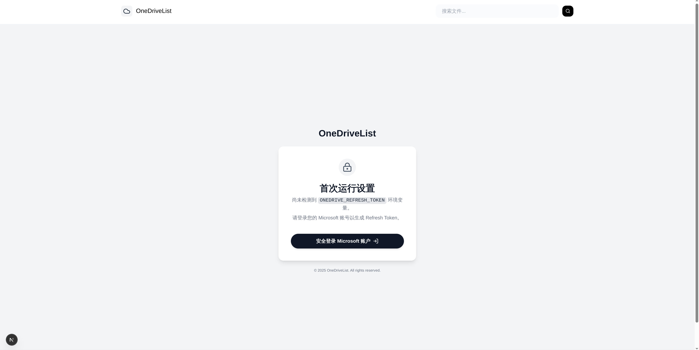
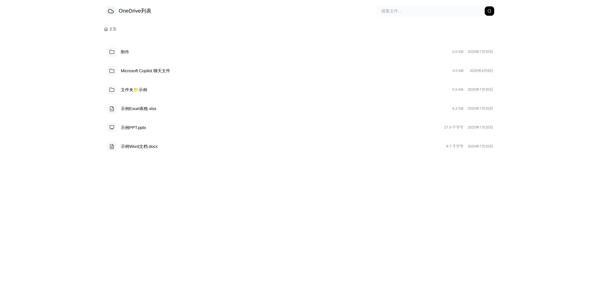

# OneList - A Next.js OneDrive File Page




OneList is a modern, open-source web application built with Next.js that allows you to browse and display files from a Microsoft OneDrive account. It features a clean, responsive interface, secure authentication, and shareable, persistent links to files and folders.

This project was bootstrapped using `create-next-app`.

[Demo](https://list.lurenapp.uk/)

## Features

- **Secure Authentication**: Uses Auth.js (NextAuth.js) with the Microsoft Entra ID provider for robust and secure user login.
- **Optional Password Protection**: Require a password before accessing the site when configured.
- **Dynamic File Browsing**: Navigate through your OneDrive folders using a clean and intuitive interface.
- **Persistent, Shareable Links**: Each folder has a unique URL (`/files/...`) that can be shared directly.
- **File Previews**: View images, text files, and audio directly in the browser.
- **Modern Tech Stack**: Built with the latest features of Next.js 15 (App Router), React 19, and TypeScript.
- **Beautiful UI**: Styled with Tailwind CSS for a responsive and modern design.
- **Smooth Animations**: Utilizes Framer Motion for fluid and engaging user interface animations.
- **Iconography**: Crisp and clear icons provided by Lucide React.
- **Vercel Ready**: Optimized for easy deployment on the Vercel platform.

## Tech Stack

- **Framework**: [Next.js](https://nextjs.org/) 15
- **Authentication**: [Auth.js (NextAuth.js)](https://authjs.dev/)
- **Styling**: [Tailwind CSS](https://tailwindcss.com/)
- **Animations**: [Framer Motion](https://www.framer.com/motion/)
- **Icons**: [Lucide React](https://lucide.dev/)
- **Language**: [TypeScript](https://www.typescriptlang.org/)

## Getting Started

Follow these instructions to get a copy of the project up and running on your local machine.

### Prerequisites

- [Node.js](https://nodejs.org/) (v20.x or later recommended)
- [Git](https://git-scm.com/)
- A Microsoft Account with OneDrive storage.
- An Azure Account to register the application for OAuth.

### 1. Clone the Repository

```bash
git clone https://github.com/your-username/onedrivelist.git
cd onedrivelist
```

### 2. Install Dependencies

```bash
npm install
```

### 3. Set up Microsoft Entra ID App

To get apps to access OneDrive, you need to register an app in the Microsoft Entra Admin Center:

1. Enter [Microsoft Entra admin center](https://entra.microsoft.com/), select **Identity → Applications → App registrations**, and click **New registration**.
2. Fill in the application name (such as *OneList App*) and select **Accounts in any organizational directory and personal Microsoft accounts**.
3. After creation is completed, open the **Authentication** tab:
    - Click **Add a platform → Web**.
    - Add a redirect URI:
        - Development environment: `http://localhost:3000/api/auth/callback/microsoft-entra-id`
        - Production environment: `https://<your-vercel-domain>/api/auth/callback/microsoft-entra-id`
        - If you need to obtain the Refresh Token at one time, you can temporarily add `http://localhost:3000/api/auth/callback/microsoft-entra-id` (can be deleted after completion).
4. Click **New client secret** in **Certificates & secrets**, copy **Value** and save it properly.
5. Open **API permissions**, add delegation permissions: `User.Read`, `Files.ReadWrite.All`, `offline_access`, and then click **Grant admin consent**.
6. Return to the **Overview** page and copy the **Application (client) ID**. Determine `AUTH_MICROSOFT_ENTRA_ID_ISSUER` according to the tenant type:
    - Multi-tenant + Personal account: `https://login.microsoftonline.com/common/v2.0`
    - Single tenant: `https://login.microsoftonline.com/<your-tenant-id>/v2.0`
    - Multi-tenant only: `https://login.microsoftonline.com/organizations/v2.0`
    - Personal account only: `https://login.microsoftonline.com/consumers/v2.0`

After completing the above steps, you can continue to configure environment variables and obtain OneDrive Refresh Token.

### 4. Configure Environment Variables

1.  Create a `.env.local` file in the root of your project by copying the example file:

    ```bash
    cp .env.example .env.local
    ```

2.  Open `.env.local` and fill in the following values:
    - `AUTH_URL`: Base URL of your application—used for callbacks and redirects
    - `AUTH_SECRET`: A secret string used to sign tokens. Generate one using `openssl rand -base64 32` in your terminal.
    - `AUTH_MICROSOFT_ENTRA_ID_ID`: Your **Application (client) ID** from the Entra App Registration.
    - `AUTH_MICROSOFT_ENTRA_ID_SECRET`: Your **client secret value** from the Entra App Registration.
    - `AUTH_MICROSOFT_ENTRA_ID_ISSUER`: The issuer URL from the Entra App Registration (e.g., `https://login.microsoftonline.com/common/v2.0`).
    - `ONEDRIVE_REFRESH_TOKEN`: **Leave this blank for now.** You will obtain it in the next step.
    - `password` (optional): Adds a simple access password. When set, visitors must first visit `/login` and enter this value.

      Example in `.env.local`:

      ```env
      password=<your-password>
      ```

### 5. Generate Your OneDrive Refresh Token

The first time you run the application it will enter **setup mode** automatically. 
Follow these steps to obtain your permanent refresh token:

1.  Start the development server:
    ```bash
    npm run dev
    ```

2.  After the server starts:
    - For local development: Open `http://localhost:3000` in your browser
    - For Vercel deployment: Visit `https://<your-vercel-domain>`

    You will see a setup page with a "Login with Microsoft" button.
3.  Click the button and complete the login. After authentication you will be redirected to `/token`, where your refresh token is displayed on screen.
4.  Copy this token. Go to your Vercel project dashboard, navigate to **Settings > Environment Variables**, and add it as `ONEDRIVE_REFRESH_TOKEN`.
5.  Restart the development server. The app will now start in normal mode and display your OneDrive files.

### 6. Run the Development Server

With `ONEDRIVE_REFRESH_TOKEN` set, run:

Now that the refresh token is set, you can run the application publicly.

```bash
npm run dev
```

Open [http://localhost:3000](http://localhost:3000) with your browser to see your OneDrive files.

## Deployment on Vercel

This application is optimized for deployment on [Vercel](https://vercel.com/).

1.  Push your code to a Git repository (e.g., on GitHub).
2.  Import the repository into Vercel.
3.  **Configure Environment Variables**: In your Vercel project settings (under **Settings > Environment Variables**), add all the required variables from your `.env.local` file:
4.  - `AUTH_URL`
    - `AUTH_SECRET`
    - `AUTH_MICROSOFT_ENTRA_ID_ID`
    - `AUTH_MICROSOFT_ENTRA_ID_SECRET`
    - `AUTH_MICROSOFT_ENTRA_ID_ISSUER`
    - `ONEDRIVE_REFRESH_TOKEN`
    - `password` (optional)
4.  Deploy! Vercel will automatically build and deploy your Next.js application, which will now publicly display your OneDrive files without requiring any user login.

## License

This project is licensed under the MIT License - see the `LICENSE` file for details.
